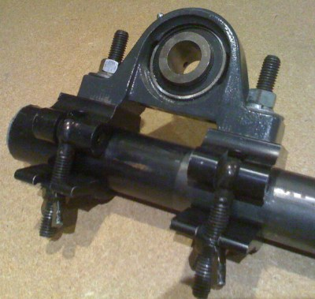

Continuing in the pivoting vein, these are the pivot points we are using for the top of the masking walls I mentioned above. If you haven’t seen the half cheesebouroughs before, they are hard to beat when attaching stuff to pipe.

edit: Oh yeah, you can find them at BMI.
