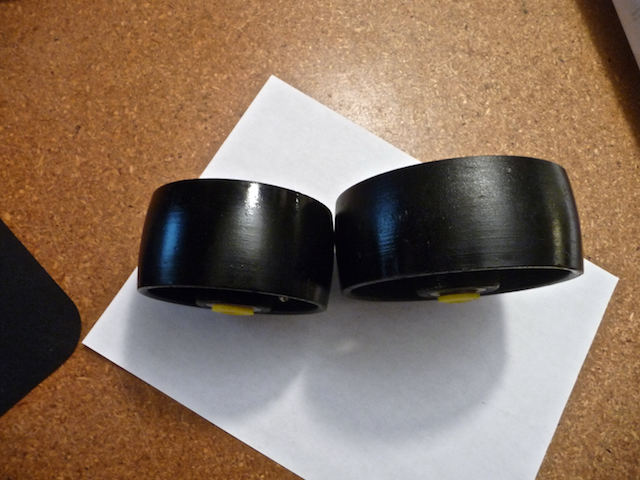

Danger Will Robinson! The cast iron wheels pictured below are the ones that were spec’ed in Keith Cornelius’s 1997 Tech Expo article_An Inexpensive, Human-Powered Roll-Former_. (Grainer part numbers are #3G262 and #3G263.) 

Obviously they’ve changed a little bit since 1997; the new “feature” is a crown to the surface of the wheel. Unless you’re looking to mangle your steel whilst bending, I suggest you find flatter wheels.

I suggest finding flatter iron wheels through [Mcmaster-Carr](http://www.Mcmaster.com/). Their 4” wheels are comparable in price, though Mcmaster’s 5” wheels are around $30 while Grainger’s 5” are around $13.
