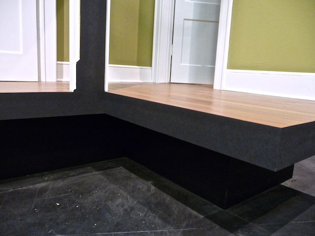

Here’s another choice for edging a deck and other scenic elements: paper. We recently did a production of _Bad Dates_ and the designer wanted a smooth black finish for the “cut” edges of the walls and deck. Since the audience was sitting only four feet from the set, we experimented with wallpapering with a 50# black kraft paper. The advantages were as follows.

- the paper is thin enough to make the edges very clean
- the texture was very flat, smooth and consistent - much like bristol board.
- there was no nap to deal with
- one roll of 12” x 750’ paper clocked in at 14 bucks. (without shipping)
- the paper allowed us to effectively disappear the seams of the planking and luan skins

All in all I was very pleased with the result. I think it was a better, more consistent finish than if we’d puttied, sanded and painted. If you go this route, be sure to do samples first! I found the paper at [Quality Paper](http://www.qualitypaperforless.com/).
