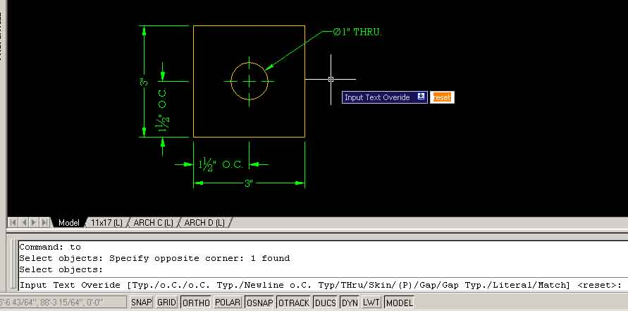

Download [Text Override Tool v2.7](https://www.scenic-shop.com/files/cad/lisp/to.lsp) - while in AutoCAD type "TO" to run this routine.

I've recently updated my text override tool for AutoCAD.  In case you didn't know, you can make the text field in a dimension read anything you want.  Ask some hardcore cad users about it, and your castle might be set upon by an angry mob.  Why do some drafters revile the text override?  Reason: lies, lies, and more damned lies.  If you can't trust the dimensions in a drawing, what can you trust?  After years of misuse by impatient and/or lazy cad users the text overrides have developed a bad rap.  Here's the truth, with great power comes great responsibility.  Take a gander at the screen shot below, and you'll see what I mean.

Cool huh?  Note that none of the actual measurements were harmed in the picture above.  In the text overrides, "1 1/2" O.C." is actually "<> O.C."  Autocad swaps out the <> with the measurement.  That's some sweet stuff.

Normally to access the text override you have to plow through the properties palette and change it manually.  Pain in the ass.  I wrote this utility to simplify the process, & now you too can access the text overrides through a friendlier interface.  I built in my own frequently used text overrides (shortcuts, if you will).  I also included a few new features from the last go around.  If you open the file in a text editor, you can change the shortcuts to your liking.  Its as easy as changing a list.

Go forth and have fun!  And remember, if you use this for evil the CAD gnomes will sneak into your bedroom and smother you in your sleep.

Changes:

- Code completely re-written from version 1.  Functions more like a lisp application and less like a script.  (Its also much prettier.)
- Much more efficient and bomb proof.
- Added options: literal and match.

Options:

- L: Literal - not using a shortcut?  Use the L option & type spaces.  Requires a return/enter key to finish.
- M: Match -make any dimension's text override match (does groups too!)
- blank line: Reset = Erase the dimension override.

Existing shortcuts: (<> = autocad's measurement)

- e.g. shortcut key = replacement text
- C  =  <> O.C.
- CT = <> O.C. TYP.
- G = <> GAP
- GT = <> GAP TYP.
- T = <> TYP.
- TH = <> THRU
- NCT = <> \[newline\] O.C. TYP.
- S = <> (SKIN)
- P = (<>) \[Parenthesis\]

