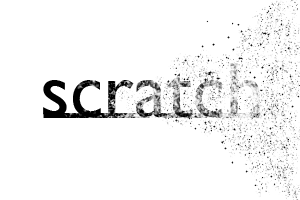

Scratch - the scratchpad layer utility for AutoCAD - has been updated to version 1.2!

[Download Scratch 1.2 here.](https://scenic-shop.com/files/cad/lisp/scratch.lsp)

Hard to believe its been over a year since I released an update to Scratch.  This update is kind of a sea change for the program, see the notes below.  On another note, this is the last release I am going to issue; I use it every day, and it hasn't been an active development project for a while.  I might post a short screencast describing how to use it.  I hope you get as much use out of it as I have.  And be forewarned, I've got some really cool stuff I've been working on.



Usage:

Note: the \` symbol is a backtick (next to the 1 key)
```
- command: \` - toggle between scratchpad layer and the current layer
- command: e\` - erase scratchpad (menu)
    - option: a - erase everything in scratchpad layer
    - option: p - preview all objects in scratchpad layer
    - option: s - erase only selected objects in scratchpad layer
- command: m\` - move selected objects to the scratchpad layer
- command: 1\` - jumps to previous layer
```

Release notes:

- consolidated scratch into one file
- changed CST command to \`
- changed EST command to e\`
- added options to the erase constructions (e\`) command
- added move object(s) to scratch layer command (x\`)
- general bugfixes
- general performance refinements and code slimming
