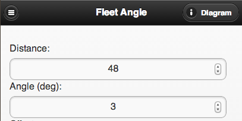

Some [Calculator](https://www.scenic-shop.com/Calculators/) updates:

I've finished an [ANSI Chain Calculator](https://www.scenic-shop.com/Calculators/chain_calcs.html); you'll find it in the main index.  It calculates the following:

- Physical properties of standard ANSI chains (multi-strands too),
- Pitch length to inch length converter
- Estimated chain elongation calculation
- Estimated chain weight per length of selected chain
- Center-to-center calculators for a two-sprocket system, calculating by sprocket centers or by chain length
- Sprocket properties for the selected chain size, including pitch diameter, outside diameter, and tooth width.

The [Fleet Angle calculator](https://www.scenic-shop.com/Calculators/fleet_angle.html) now calculates by offset, angle, and distance.  Change any one variable and the other two update. I've also added a diagram.

The [Frustum Flattener](https://www.scenic-shop.com/Calculators/frustum_flatten.html) was updated, the new navigation bar wasn't working correctly.

The [Resultant Force](https://www.scenic-shop.com/Calculators/resultant_force.html) calculator code was updated; it would sometimes fail to re-calculate when changed.

Note that I've moved the the diagrams.  They used to be located below the calculators (akk).  I've moved them into a pop-up dialogue that you can load by clicking the "Diagram" button, as shown below...

